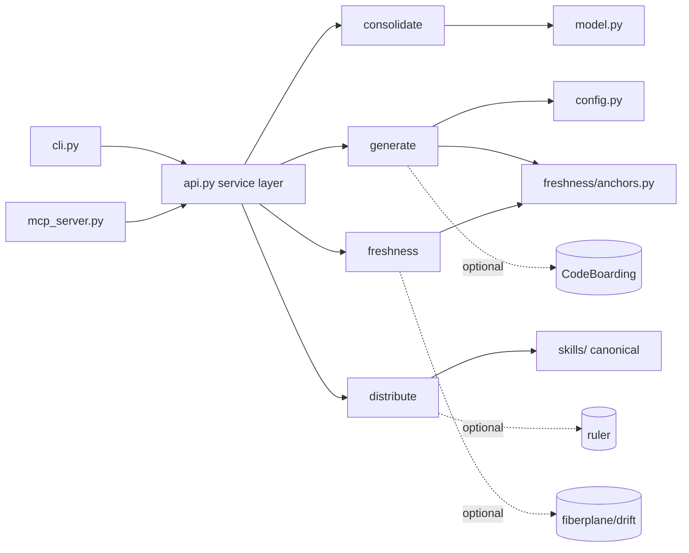

---
doctyze:
  artifact: diagram
  generated_by: write-architecture
  source: [doctyze/cli.py]
  affects: [doctyze/cli.py, doctyze/consolidate/**, doctyze/generate/**, doctyze/distribute/**, doctyze/freshness/**]
  last_verified: '2026-06-15'
---

# Pipeline & Integration Diagrams

## Pipeline (the four jobs)

```mermaid
flowchart TD
    repo[Any repo, any stack] --> consolidate
    subgraph Doctyze engine (deterministic, no LLM)
        consolidate[consolidate<br/>audit → plan → apply] --> canon[canonical docs/]
        bootstrap[bootstrap<br/>stack detect + scaffold] --> canon
        canon --> distribute[distribute<br/>fan-out skills]
        canon --> watch[watch<br/>anchors + git diff → stale docs]
    end
    distribute --> agentfiles[.claude/skills · .cursor/rules · AGENTS.md · MCP]
    bootstrap -. manifest .-> agent[Existing IDE/CI agent<br/>brings the LLM]
    agent -- generates prose --> canon
    watch -- refresh manifest --> agent
```

## Module dependencies



The dotted nodes are optional adopted OSS — each has a built-in fallback so the engine runs with none of them installed.
