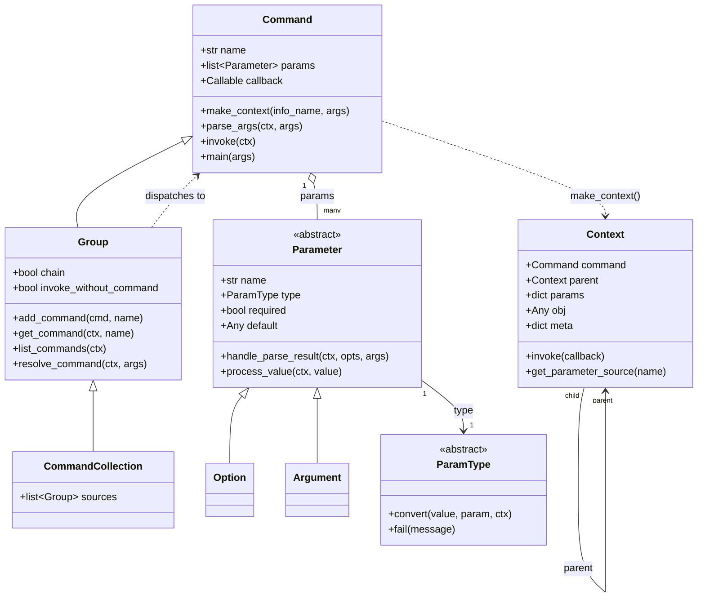

---
doctyze:
  artifact: architecture
  generated_by: write-architecture
  affects: [src/click/core.py]
  last_verified: 2026-07-05
---
# Object model

The runtime objects in [`core.py`](../../../../src/click/core.py) and how they relate. `Group` is a
`Command` (so groups nest like commands), and `Option`/`Argument` are both `Parameter`s.

Notes grounded in the code:

- **`Group <|-- CommandCollection`** ([`core.py:2071`](../../../../src/click/core.py)) — a collection
  merges the subcommands of several source groups behind one namespace.
- **`Context.parent`** is the mechanism behind nested state sharing (see
  [ADR-0001](../decisions/0001-context-threads-invocation-state.md)).
- Every `Parameter` delegates coercion to its `ParamType.convert()` — the type system is the single
  place values become non-string Python objects.
