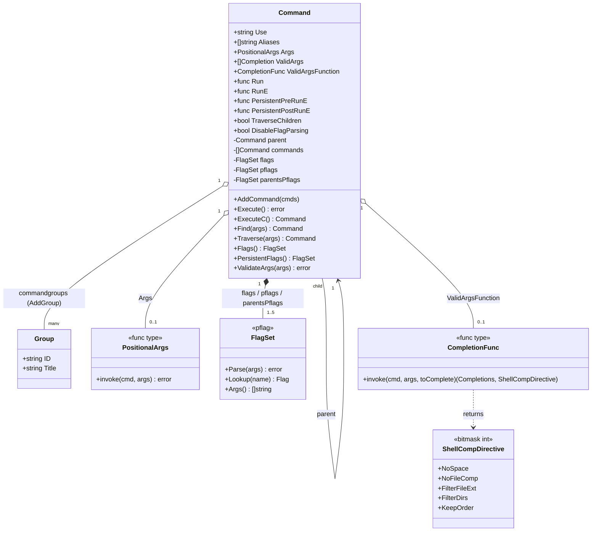

---
doctyze:
  artifact: architecture
  generated_by: write-architecture
  affects: [command.go, args.go, completions.go]
  last_verified: 2026-07-05
---
# Object model

The runtime objects in `command.go` (with `args.go` and `completions.go`) and how they relate. The
whole CLI is **one self-referential `Command` type**: a command owns child `commands` and points at its
`parent`, so a node with children behaves as a group. Flags are `*pflag.FlagSet` values borrowed from
`github.com/spf13/pflag`. `Group` here is a help-display label (`{ID, Title}`), not a container.

Notes grounded in the code:

- **`Command` is the group.** `AddCommand` (`command.go:1342`) sets `cmds[i].parent = c` and appends to
  `c.commands`; there is no separate group class. `HasSubCommands` (`command.go:1601`) is simply
  `len(c.commands) > 0`, and `Runnable` (`command.go:1596`) is `Run != nil || RunE != nil`.
- **Five flag sets per command.** A `Command` lazily builds `flags` (the merged set actually parsed),
  `pflags` (its own persistent flags), and the caches `lflags`/`iflags`/`parentsPflags`. `Flags()`
  (`command.go:1688`) returns the merged set; `PersistentFlags()` (`command.go:1775`) the persistent
  ones; `InheritedFlags()` (`command.go:1744`) those contributed by ancestors.
- **`Args` is a function, not a schema.** The `PositionalArgs` field points at a validator from
  `args.go`; `ValidateArgs` (`command.go:1172`) invokes it, falling back to `ArbitraryArgs` when unset.
- **Completion is data on the command.** Either static `ValidArgs` (`[]Completion`, a string alias) or a
  dynamic `ValidArgsFunction` (`CompletionFunc`, `completions.go:139`) drives argument completion; both
  return a `ShellCompDirective` bitmask that tells the shell how to behave (see
  [shell completion spec](../../specs/shell-completion.md)).
- **`Group` vs. tree.** `commandgroups` (populated by `AddGroup`) only affects how children are bucketed
  in help; it is orthogonal to the `parent`/`commands` tree structure.

See also [ADR-0001](../decisions/0001-persistent-flags-and-hooks-inherit-down-the-tree.md) on why the
flag sets and hooks inherit down the tree.
