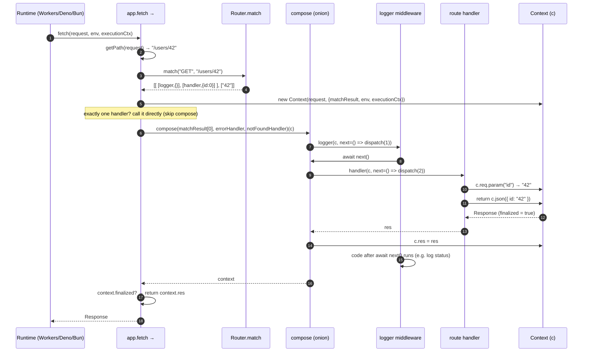

---
doctyze:
  artifact: architecture
  generated_by: write-architecture
  affects: [src/hono-base.ts, src/compose.ts, src/context.ts, src/router/smart-router/router.ts]
  last_verified: 2026-07-05
---
# Request lifecycle

What happens between a runtime handing Hono a `Request` and the app returning a `Response`, for an
app with one middleware plus a route handler (`app.use(logger); app.get('/users/:id', handler)`).
Grounded in `fetch` / `#dispatch` (`hono-base.ts`), `Router.match` (`smart-router/router.ts`), the
onion in `compose.ts`, and the response builders on `Context` (`context.ts`).

Key facts:

- **Onion order.** `compose` (`compose.ts`) runs `dispatch(0)`; each handler gets
  `next = () => dispatch(i + 1)`. Awaiting `next()` runs the rest of the chain and returns, so code
  *after* `await next()` executes on the way back out — that is the "before / after" middleware model.
  Calling `next()` twice throws `next() called multiple times` (guarded by the `index` cursor).
- **Fast path.** When `matchResult[0].length === 1`, `#dispatch` invokes the single handler directly
  and never allocates a composed chain.
- **Finalization.** A handler finalizes the response by returning a `Response` (via `c.json`, `c.text`,
  `c.body`, …) or by setting `c.res`. If, after the chain, `context.finalized` is still `false`,
  `#dispatch` throws *"Context is not finalized. Did you forget to return a Response object or
  `await next()`?"*.
- **Failure path.** If a handler throws an `Error`, `compose` catches it, sets `c.error`, and calls
  the app's `errorHandler`; a request that matches nothing runs the `notFoundHandler` (default:
  `c.text('404 Not Found', 404)`).
- **`HEAD`.** `#dispatch` re-dispatches `HEAD` as `GET` and returns the headers/status with a `null`
  body.
