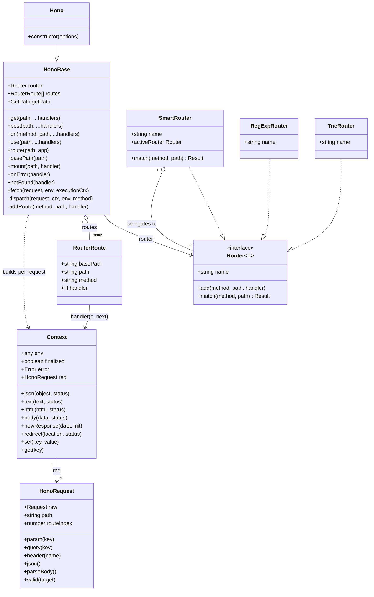

---
doctyze:
  artifact: architecture
  generated_by: write-architecture
  affects: [src/hono-base.ts, src/hono.ts, src/router.ts, src/router/smart-router/router.ts, src/router/reg-exp-router/router.ts, src/router/trie-router/router.ts, src/context.ts, src/request.ts, src/types.ts]
  last_verified: 2026-07-05
---
# Object model

The runtime objects of the Hono core. `Hono` (`hono.ts`) is a thin subclass of `HonoBase`
(`hono-base.ts`); the app depends only on the `Router<T>` interface (`router.ts`), which every
matcher — including the meta `SmartRouter` — implements. Each request gets one `Context`
(`context.ts`) that owns a lazily-built `HonoRequest` (`request.ts`).

Notes grounded in the code:

- **`Hono --|> HonoBase`** — `HonoBase` deliberately ships *without* a router (its comment calls it
  "like an abstract class"); the concrete `Hono` constructor (`hono.ts`) assigns
  `new SmartRouter({ routers: [new RegExpRouter(), new TrieRouter()] })` unless the caller passes a
  `router` option.
- **`SmartRouter o-- Router`** — `SmartRouter` (`smart-router/router.ts`) holds a list of candidate
  routers and, on the first `match`, buffers every route into each candidate until one succeeds; it
  then rebinds its own `match` to the winner. `RegExpRouter` and `TrieRouter` are the two defaults;
  `LinearRouter` and `PatternRouter` also implement `Router<T>`. See
  [ADR-0001](../decisions/0001-pluggable-router-with-smartrouter.md).
- **`Context "1" --> "1" HonoRequest`** — `c.req` is created lazily (`this.#req ??= new HonoRequest(...)`)
  from the raw `Request`, the derived `path`, and the router's `matchResult`, so path params flow
  from `match` into `c.req.param()`.
- Every registered `handler` is invoked as `handler(c, next)`; the `RouterRoute` record just carries
  its `method` / `path` / `basePath` metadata for introspection.
