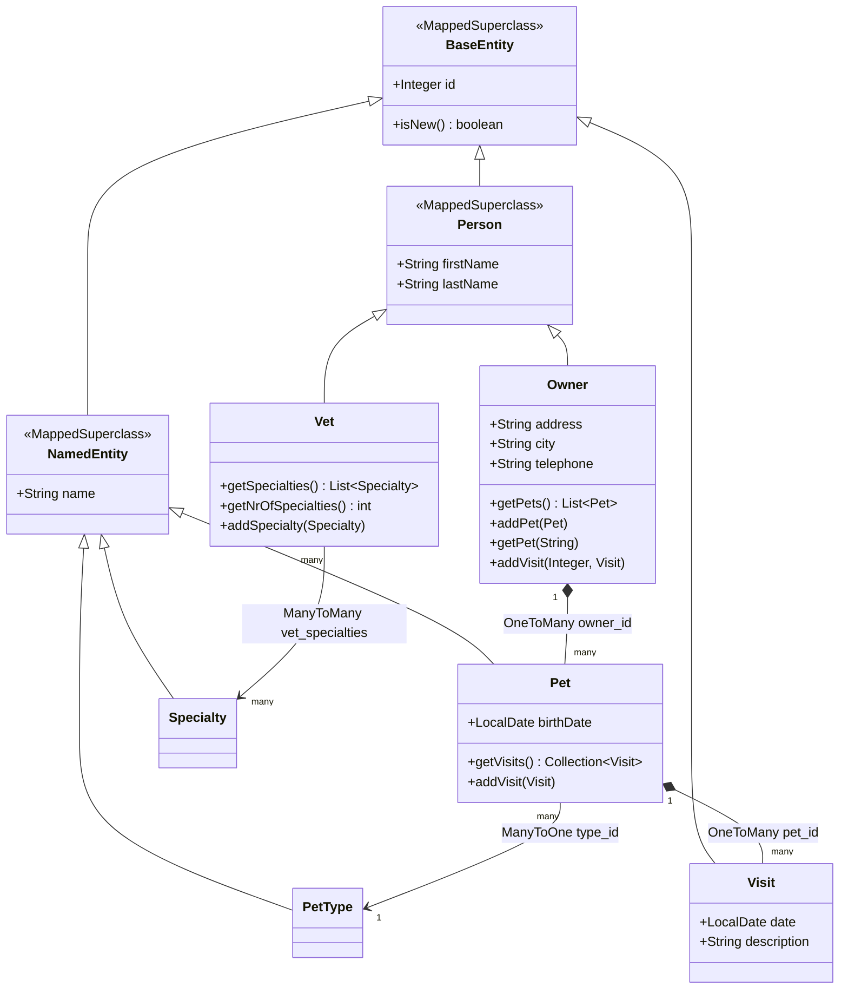

---
doctyze:
  artifact: architecture
  generated_by: write-architecture
  affects: [src/main/java/org/springframework/samples/petclinic/model/BaseEntity.java, src/main/java/org/springframework/samples/petclinic/model/NamedEntity.java, src/main/java/org/springframework/samples/petclinic/model/Person.java, src/main/java/org/springframework/samples/petclinic/owner/Owner.java, src/main/java/org/springframework/samples/petclinic/owner/Pet.java, src/main/java/org/springframework/samples/petclinic/owner/PetType.java, src/main/java/org/springframework/samples/petclinic/owner/Visit.java, src/main/java/org/springframework/samples/petclinic/vet/Vet.java, src/main/java/org/springframework/samples/petclinic/vet/Specialty.java]
  last_verified: 2026-07-06
---
# Domain model

The persistent domain and its inheritance. The three `model/` types (`BaseEntity`, `NamedEntity`,
`Person`) are `@MappedSuperclass` bases — they contribute columns but are not tables. The leaf classes
(`Owner`, `Pet`, `PetType`, `Visit`, `Vet`, `Specialty`) are `@Entity` types mapped to real tables.

Notes grounded in the code:

- **`Owner` → `Pet`** is `@OneToMany(cascade = CascadeType.ALL, fetch = FetchType.EAGER)` with
  `@JoinColumn(name = "owner_id")` and `@OrderBy("name")`. The collection is a `final List<Pet>`, so an
  owner owns its pets and cascades saves/deletes to them (`Owner.java`).
- **`Pet` → `PetType`** is `@ManyToOne` with `@JoinColumn(name = "type_id")` — a pet has exactly one
  type, but `PetType` rows (Cat, Dog, Hamster…) are shared reference data, not owned by any pet (`Pet.java`).
- **`Pet` → `Visit`** is `@OneToMany(cascade = CascadeType.ALL, fetch = FetchType.EAGER)` with
  `@JoinColumn(name = "pet_id")` and `@OrderBy("date ASC")`, backed by a `final Set<Visit>` (a
  `LinkedHashSet`). `Visit` itself extends `BaseEntity` directly and stores `date` (mapped to column
  `visit_date`) and a `@NotBlank description` (`Visit.java`).
- **`Vet` → `Specialty`** is `@ManyToMany(fetch = FetchType.EAGER)` via `@JoinTable(name = "vet_specialties", ...)`.
  `Vet.getSpecialties()` returns the specialties sorted by name using `Comparator.comparing(NamedEntity::getName)`
  (`Vet.java`).
- `PetType` and `Specialty` are thin — both are empty `@Entity` subclasses of `NamedEntity`, existing
  only to give the shared `name` its own table (`types`, `specialties`).

See the [architecture overview](../overview.md) for how these entities move through the request pipeline.
