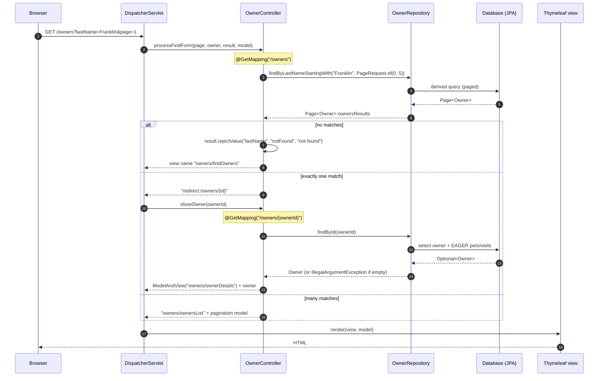

---
doctyze:
  artifact: architecture
  generated_by: write-architecture
  affects: [src/main/java/org/springframework/samples/petclinic/owner/OwnerController.java, src/main/java/org/springframework/samples/petclinic/owner/OwnerRepository.java, src/main/java/org/springframework/samples/petclinic/owner/Owner.java]
  last_verified: 2026-07-06
---
# Request lifecycle

What happens between an HTTP request and a rendered Thymeleaf page, using the "find owners" and
"show owner" flows in `OwnerController.java` as the worked example. Grounded in `OwnerController`,
`OwnerRepository`, and the `Owner` aggregate.

Key facts grounded in the code:

- **Binder + model setup runs first.** Before any handler, `OwnerController`'s `@InitBinder`
  `setAllowedFields(...)` calls `dataBinder.setDisallowedFields("id", "*.id")`, and the
  `@ModelAttribute("owner") findOwner(...)` method pre-loads the `owner` model object (a fresh `Owner`
  when no `ownerId` path variable is present, otherwise `owners.findById(ownerId)`).
- **Paging is explicit.** `findPaginatedForOwnersLastName(...)` builds a `PageRequest.of(page - 1, 5)`
  and calls the derived query `OwnerRepository.findByLastNameStartingWith(lastName, pageable)`, which
  returns a Spring Data `Page<Owner>`.
- **Single-result shortcut.** When `getTotalElements() == 1`, the controller redirects straight to
  `/owners/{id}` rather than rendering a one-row list.
- **Missing entity → exception.** `showOwner(...)` does `findById(ownerId).orElseThrow(() -> new IllegalArgumentException(...))`,
  so an unknown id surfaces as an error rather than a null.
- **Controllers return view names, not HTML.** The returned `String` (e.g. `"owners/ownerDetails"`) or
  `ModelAndView` view name is resolved to a Thymeleaf template by Spring MVC.

For form-submission handlers (`@PostMapping`) the same pipeline additionally runs `@Valid` Bean
Validation and collects errors in a `BindingResult`; see [Owner/Pet/Visit domain](../../specs/owner-pet-visit-domain.md).
