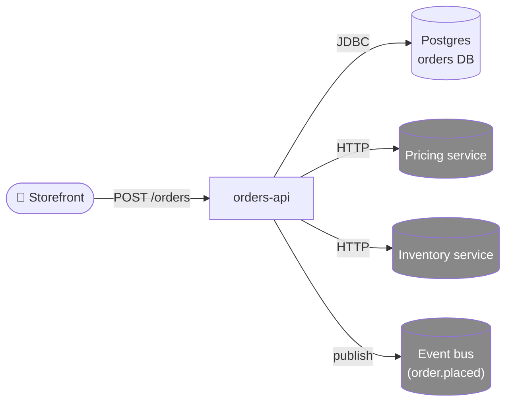

# orders-api — Architecture overview

> Confidence: 🟢 CONFIRMED. Hand-authored for the Doctyze worked example.

## Purpose

Accept orders from the storefront, validate inventory and pricing, persist
durably to Postgres, fire an `order.placed` event for downstream systems
(billing, fulfillment, analytics).

## System context

See [`diagrams/system-context.mmd`](diagrams/system-context.mmd) for source.

## Key flow — POST /orders

1. Storefront submits an order with SKU + quantity + customer ID.
2. orders-api validates auth + payload.
3. orders-api calls pricing service for the live price.
   - **If pricing is unreachable**: use cached price per ADR-0003 (fail open).
4. orders-api calls inventory service to reserve stock.
5. orders-api writes the order to Postgres in a single transaction.
6. orders-api publishes `order.placed` to the event bus.
7. orders-api returns 201 Created.

## Deployment

- Containerized (Dockerfile + multi-stage build).
- Kubernetes Deployment, 3 replicas, behind an internal HTTP load balancer.
- Postgres is a managed RDS cluster; failover handled at the infra layer.

## Source of truth

Canonical architectural model: [`workspace.dsl`](workspace.dsl) (Structurizr C4).
The Mermaid diagrams above are derived views for inline rendering on GitHub.

## Related

- [Architecture Decision Records](decisions/)
- [Runbooks](../runbooks/)
- [API contract](../api/openapi.yaml)
